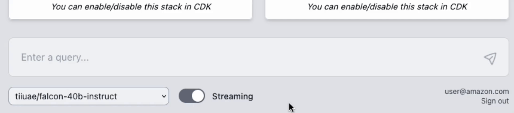
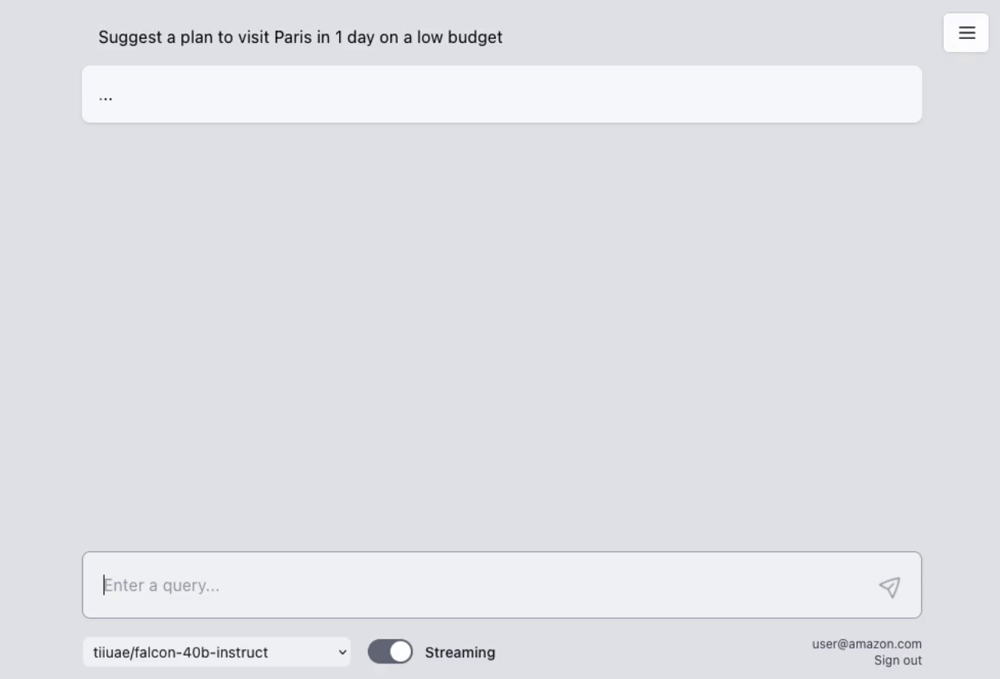
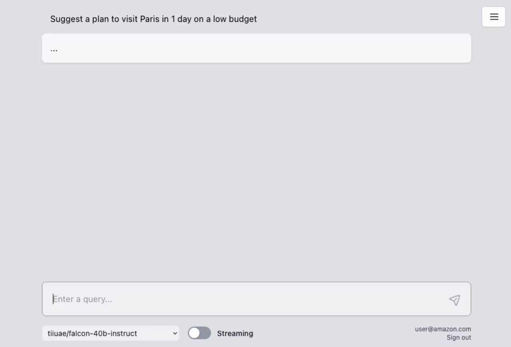
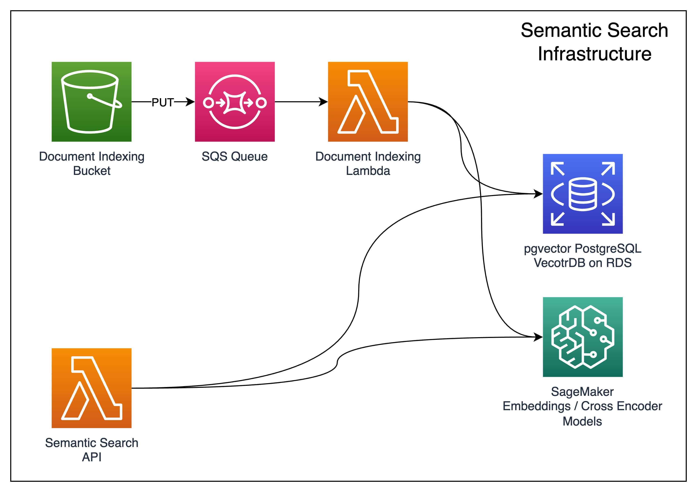
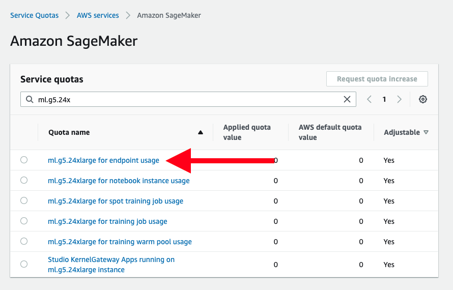

# Deploy a multi LLM powered chatbot using AWS CDK on AWS


## Table of content
- [Features](#features)
- [Architecture](#architecture)
- [Security](#security)
- [Precautions](#precautions)
- [Service Quotas and Preview Access](#service-quotas-and-preview-access)
- [Deploy](#deploy)
- [Clean up](#clean-up)
- [Deploying additional models](#deploying-additional-models)
- [Credits](#credits)
- [License](#license)

# Features

## Comprehensive, ready to use
This sample provides code ready to use so you can start **experimenting with different LLMs and prompts.**

For additional features provided in this sample such as [**Amazon SageMaker Foundation models**](https://docs.aws.amazon.com/sagemaker/latest/dg/jumpstart-foundation-models-choose.html) support you are required to request [quota increases and preview access](#service-quotas-and-preview-access).

## Multimodel 
You have the flexibility to test multiple LLM models concurrently. This unique feature is enabled by a user-friendly web UI, allowing for a experimentation of different models within your own VPC.



## AWS Lambda Response Streaming
The sample takes advantage of the newly released [**AWS Lambda Response Streaming**](https://aws.amazon.com/blogs/compute/introducing-aws-lambda-response-streaming/) feature, replicating LLM streaming capabilities even with synchronous requests to **SageMaker endpoint** by querying for completion for small batches of tokens iteratively.


|  |  |
|:--:|:--:|
| Small batches of tokens predictions  | Standard single blocking request |

## Full-fledged UI
The repository also includes a **full-fledged UI** built with [React](https://react.dev/) to interact with the deployed LLMs as chatbots. It supports both standard requests and streaming modes for hitting LLM endpoint, allows managing conversation history, switching between deployed models, and even features a dark mode for user preference. Hosted on **[Amazon S3](https://aws.amazon.com/s3/)** and distributed with [**Amazon CloudFront**](https://aws.amazon.com/cloudfront/).

## LLM sources 

This sample comes with a prupose-built CDK Construct, [LargeLanguageModel](./lib/large-language-model/index.ts#L12), which helps abstracting 3 different types of model deployments

#### SageMaker Foundation Models
The sample allows you to deploy models from [**Amazon SageMaker Foundation models**](https://docs.aws.amazon.com/sagemaker/latest/dg/jumpstart-foundation-models-choose.html) by specifying the model ARN. This simplifies the deployment process of these powerful AI models on AWS.

```typescript
new LargeLanguageModel(this, 'FoundationModelId', {
  vpc,
  region: this.region,
  model: {
    kind: ModelKind.Package,
    modelId: 'modelId', // i.e. ai21/j2-grande-instruct-v1 - this is an arbitrary ID  
    instanceType: 'instanceType', // i.e. ml.g5.12xlarge
    packages: (scope) =>
      new cdk.CfnMapping(scope, 'ModelPackageMapping', {
        lazy: true,
        mapping: {
          'region': { arn: 'container-arn' }, // ARN usually found in sample notebook from SageMaker foundation page
        },
      }),
    },
});
```

#### Hugging Face LLM Inference Container
The solution provides support for all publicly accessible LLMs supported by [HuggingFace LLM Inference container](https://huggingface.co/blog/sagemaker-huggingface-llm), thereby expanding your model options and letting you leverage a wide variety of pre-trained models available on this platform.

```typescript
new LargeLanguageModel(this, 'HFModel', {
    vpc,
    region: this.region,
    model: {
      kind: ModelKind.Container,
      modelId: 'modelId', // i.e. tiiuae/falcon-40b-instruct - this must match HuggingFace Model ID
      container: ContainerImages.HF_PYTORCH_LLM_TGI_INFERENCE_LATEST,
      instanceType: 'instanceType', // i.e. ml.g5.24xlarge
      env: {
        ...
      },
    },
  });
```

#### Models with custom inference
While the options above are preferred, for broader compatibility, the sample also showcases deployment of all other models from Hugging Face not supported by HuggingFace LLM Infernce container using custom inference code. This process is powered by **AWS CodeBuild**.

For this kind of deployment you need to choose the right container for your model from this list of [AWS Deep Learning Containers](https://github.com/aws/deep-learning-containers/blob/master/available_images.md). Based on PyTorch/Transformers versions, Python version etc.

```typescript
new LargeLanguageModel(this, 'ModelId', {
  vpc,
  region: this.region,
  model: {
    kind: ModelKind.CustomScript,
    modelId: 'modelId', // i.e. sentence-transformers/all-MiniLM-L6-v2 - this must match HuggingFace Model ID
    codeFolder: 'localFolder', // see for example ./lib/semantic-search/embeddings-model
    container: 'container-arn', // One from https://github.com/aws/deep-learning-containers/blob/master/available_images.md
    instanceType: 'instanceType', // i.e. g5.12xlarge
    codeBuildComputeType: codebuild.ComputeType.LARGE, // Size of CodeBuild instance. Must have enough storage to download the whole model repository from HuggingFace
  }
});
```

## Semantic search
The sample provides an optional stack to implement a **vector database** on **Amazon RDS** with **pgvector** and embeddings. 

Allowing **Hybrid Searches** performed with a combination of Similiary Search and a Full Text Search, which enable an emerging patterns in LLM applications such as "In-Context Learning" (RAG) with automatic document indexing on **Amazon S3** upload.

# Architecture
Here's an overview of the sample's architecture


### VPC Stack
This stack deploys public, private, and isolated subnets. The public subnet is used for the chatbot backend supporting the user interface, the private subnet is used for SageMaker models, and the isolated subnet is used for the RDS database. Additionally, this stack deploys VPC endpoints for SageMaker endpoints, AWS Secrets Manager, S3, and Amazon DynamoDB, ensuring that traffic stays within the VPC when appropriate.

### ChatBot Stack
This stack contains the necessary resources to set up a chatbot system, including:
- The ability to deploy one or more large language models through a custom construct, supporting three different techniques: 
  - Deploying models from SageMaker Foundation models by specifying the specific model ARN.
  - Deploying models supported by the HuggingFace TGI container.
  - Deploying all other models from Hugging Face with custom inference code.
- Backend resources for the user interface, including chat backend actions and a Cognito user pool for authentication.
- A DynamoDB-backed system for managing conversation history.

This stack also incorporates "model adapters", enabling the setup of different parameters and functions for specific models without changing the core logic to perform requests and consume responses from SageMaker endpoints for different LLMs.

### [Optional] Semantic Search Stack 
This stack is `disabled` by default. To enable it update [bin/aws-genai-llm-chatbot.ts](./bin/aws-genai-llm-chatbot.ts#L13)



An optional semantic search stack that deploys:
- A vector database via a custom construct built on top of PostgreSQL on RDS with pgvector.
- An embeddings model on SageMaker to generate embeddings.
- Encoders model on SageMaker used to rank sentences by similarity.
- An S3 bucket to store documents that, once uploaded, are automatically split up, converted into embeddings, and stored in the vector database.
- A Lambda function showcasing how to run hybrid search with pgvector. This function also serves as the entry point for this stack.


## [Optional] User Interface
This stack is `enabled` by default. To disable it update [bin/aws-genai-llm-chatbot.ts](./bin/aws-genai-llm-chatbot.ts#L12)

A comprehensive UI built with [React](https://react.dev/) that interacts with the deployed LLMs as chatbots, supporting sync requests and streaming modes to hit LLM endpoints, managing conversation history, stopping model generation in streaming mode, and switching between all deployed models for experimentation.

# Security

This sample underscores the importance of infrastructure security in deploying LLM applications. Here are the key security measures showcased in this sample:

## Deployment in Private and Isolated Subnets
The LLM models and vector databases are deployed in private and isolated subnets, providing an additional layer of protection.

## Use of VPC Endpoints
**VPC endpoints** are used for in-VPC traffic, ensuring that traffic that doesn't need to leave the VPC stays within the VPC.

## Amazon Cognito Authentication for User Interface
Leverage [**Amazon Cognito**](https://aws.amazon.com/cognito/) for user interface authentication, ensuring secure access to the chatbot.

# Precautions

Before you begin using the sample, there are certain precautions you must take into account:

- **Cost Management**: Be mindful of the costs associated with AWS resources. While the sample is designed to be cost-effective, leaving resources running for extended periods or deploying numerous LLMs can quickly lead to increased costs.

- **Licensing obligations**: If you choose to use any datasets or models alongside the provided samples, ensure you check LLM code and comply with all licensing obligations attached to them.


# Service Quotas and Preview Access
No service quota or preview access is needed to start experimenting with the provided sample. However to leverage specific features and for enchanced speed you are currently required to request quota increase and preview access. Specifically:

- **Instance type quota increase**
You might consider requesting an increase in service quota for specific SageMaker instance types such as the `ml.g5` instance type. This will give access to latest generation of GPU/Multi-GPU instances types. You can do this from the AWS console.

- **Foundation Models Preview Access**
If you are looking to deploy models from SageMaker foundation models, you need to request preview access from the AWS console.
Futhermore, make sure which regions are currently supported for SageMaker foundation models.

# Deploy

###  Prerequisites

###  Request quota increase for ml.g5 instances
Most LLMs require instances with 1 or multiple GPUs. If you are deploying models that can run on CPUs only, you can skip this step.

To achieve this you will need to request specific `ml.g5` instance types depending on the model deployed.

For example, with `Falcon-40B-instrcut` you should request `ml.g5.24xlarge` instance.

For example look for: `ml.g5.24xlarge for endpoint usage` in case your model needs a `ml.g5.24xlarge`.

Quota increase can be requested from the AWS console under self-service **[Service Quotas](https://console.aws.amazon.com/servicequotas/home/services/sagemaker/quotas)**.




###  Environment

Verify that your environment satisfies the following prerequisites:

You have:

1. An [AWS account](https://aws.amazon.com/premiumsupport/knowledge-center/create-and-activate-aws-account/)
2. `AdministratorAccess` policy granted to your AWS account (for production, we recommend restricting access as needed)
3. Both console and programmatic access
4. [AWS CLI](https://aws.amazon.com/cli/) installed and configured to use with your AWS account
5. [NodeJS 18+](https://nodejs.org/en/download/) installed
6. [Typescript 3.8+](https://www.typescriptlang.org/download) installed
7. [AWS CDK CLI](https://docs.aws.amazon.com/cdk/latest/guide/getting_started.html) installed
8. [Docker](https://docs.docker.com/get-docker/) installed
9. [Python 3+](https://www.python.org/downloads/) installed


### Prepare CDK

The solution will be deployed into your AWS account using infrastructure-as-code wih the [AWS Cloud Development Kit](https://aws.amazon.com/cdk/) (CDK).

1. Clone the repository:

```bash
git clone https://github.com/aws-samples/aws-genai-llm-chatbot.git
```

2. Navigate to this project on your computer using your terminal:

```bash
cd aws-genai-llm-chatbot
```

3. Install the project dependencies by running this command:

```bash
npm install
```

4. (Optional) Bootstrap AWS CDK on the target account and regioon

> **Note**: This is required if you have never used AWS CDK before on this account and region combination. ([More information on CDK bootstrapping](https://docs.aws.amazon.com/cdk/latest/guide/cli.html#cli-bootstrap)).

```bash
npx cdk bootstrap aws://{targetAccountId}/{targetRegion}
```

### Deploy the solution to your AWS Account

1. Verify that Docker is running with the following command:

```bash
docker version
```

> **Note**: If you get an error like the one below, then Docker is not running and need to be restarted:

```bash
Cannot connect to the Docker daemon at unix:///var/run/docker.sock. Is the docker daemon running?
```

2. Deploy the sample using the following CDK command:

```bash
npx cdk deploy --all
```

> **Note**: This step duration can vary a lot, depending on the model(s) you want to deploy, for example the very first deployment with Falcon-40B can take about 30 minutes.


3. You can view the progress of your CDK deployment in the [CloudFormation console](https://console.aws.amazon.com/cloudformation/home) in the selected region.

4. Once deployed, take note of the UI URL `GenAI-ChatBotUIStack.DomainName` value

```bash
...
Outputs:
GenAI-ChatBotUIStack.DomainName = dxxxxxxxxxxxxx.cloudfront.net
...
```

5. Make sure to add a user to the generated **Cognito User Pool** from `GenAI-ChatBotStack` in order to be able to access the webapp.


# Clean up
You can remove the stacks and all the associated resources created in your AWS account by running the following command:

```bash
npx cdk destroy --all
```

# Deploying additional models
As part of this sample, you can find some additional model by uncommenting code in [lib/chatbot-stack.ts](./lib/chatbot-stack.ts#L58)

> **Note**: We strongly suggest to deploy one new model at the time, since the SageMaker endpoint creations and rollback time can take time.

For new models make sure to select the right type of `kind` depending on the source of the LLM see [related section above](#llm-sources).

Create a `model adapter` by extending the [ModelAdapterBase](./lib/chatbot-backend/functions/send-message/adapters/base.ts).

You can find examples of model adapters in [lib/chatbot-backend/functions/send-message/adapters](./lib/chatbot-backend/functions/send-message/adapters/)

```typescript
export class NewModelAdapter extends ModelAdapterBase {
  /*
    Set up model-specific LancgChain content handler.
  */
  getContentHandler() {
    return new NewModelContentHandler();
  }

  /*
    Method to give ability to generated model-specific prompts
  */
  async getPrompt(args: GetPromptArgs) {
    /* 
      For each request, you will have access to:

      args.prompt 
      string containg the user request
      
      args.context
      if semantic serach is enabled and hybrid search returns text similar to prompt is available here to use as context in the format of 
      [
        'string1',
        'string2',
      ]

      args.history
      list of previous turns of conversation in the format of 
      [
        { sender: 'user/system', 'content': 'message'},
        ...
      ]
      
       Example code:

      const { prompt, history, context } = args;

      const historyString = history.map((h) => `${h.sender}: ${h.content}`).join('\n');
      const contextString = context.length > 0 ? context.join('\n') : 'No context.';

      let completePrompt = `You are a helpful AI assistant. The following is a conversation between you (the system) and the user.\n${historyString || 'No history.'}\n\n`;
      completePrompt += `This is the context for the current request:\n${contextString}\n`;
      completePrompt += `Write a response that appropriately completes the request based on the context provided and the conversastion history.\nRequest:\n${prompt}\nResponse:\n`;

      return completePrompt;

    */
  }

  /*
    Method to define the model-specific stopWords
    stopWords are used as reference to when stop text generations.
  */
  async getStopWords() {
  /*
    Example:

    return ['<|endoftext|>', 'User:', 'Falcon:', '</s>'];
  */
  }
}
```

Add your `Adapter` to the [model registry](./lib/chatbot-backend/functions/send-message/adapters/registry.ts#L26).

```typescript
...
modelAdapterRegistry.add(/^your-regex/, NewModelAdapter);
```
RegEx expression will allow you to use the same adapter for a different models matching your regex.

For example `/^tiiuae\/falcon/` will match all model IDs starting with `tiiuae/falcon`


Finally, add your model to [lib/chatbot-stack.ts](./lib/chatbot-stack.ts)
```typescript
new LargeLanguageModel(this, 'NewModel', {
    vpc,
    region: this.region,
    model: {
      kind: ModelKind.Container, // or the preferred kind
      modelId: 'modelId', // i.e. tiiuae/falcon-40b-instruct, 
      container: ContainerImages.HF_PYTORCH_LLM_TGI_INFERENCE_LATEST,
      instanceType: 'instanceType', // i.e. ml.g5.24xlarge
      env: {
        ...
      },
    },
  });
```


# Credits

This sample was made possible thanks to the following libraries:
- [langchain](https://python.langchain.com/docs/get_started/introduction.html) from [Harrison Chase](https://github.com/hwchase17)
- [pgvector](https://github.com/pgvector/pgvector) from [Andrew Kane](https://github.com/ankane)

# License

This library is licensed under the MIT-0 License. See the LICENSE file.

- [Changelog](CHANGELOG.md) of the project.
- [License](LICENSE) of the project.
- [Code of Conduct](CODE_OF_CONDUCT.md) of the project.
- [CONTRIBUTING](CONTRIBUTING.md#security-issue-notifications) for more information.
