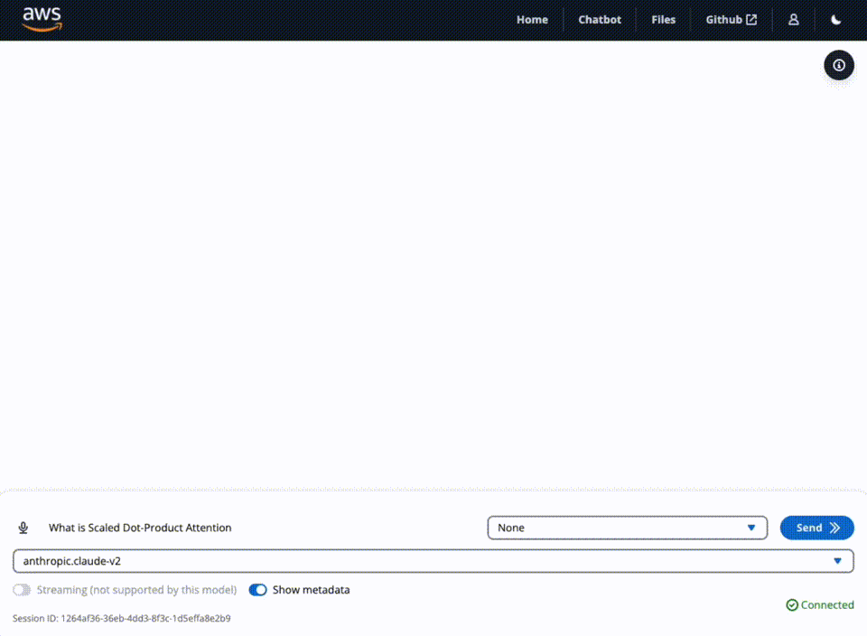
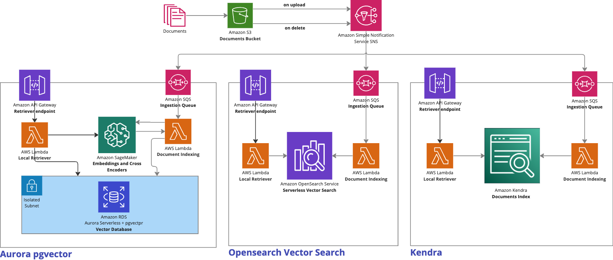

# Deploy a multi LLM and multi RAG powered chatbot using AWS CDK on AWS


## Table of content
- [Features](#features)
- [Architecture](#architecture)
- [Precautions](#precautions)
- [Preview Access and Service Quotas](#service-quotas-and-preview-access)
- [Models Providers](#providers)
  - [Amazon Bedrock](#amazon-bedrock-preview)
  - [Self-hosted models on SageMaker](#self-hosted-models-on-sagemaker)
  - [3P models providers](#3p-models-providers)
- [RAG Sources](#retrieval-augmented-generation-rag-cdk-constructs)
  - [Aurora Serverless with pgvector](#amazon-aurora-with-pgvector)
  - [Amazon OpenSearch VectorSearch](#amazon-opensearch-vectorsearch-requires-bedrock-preview-access)
  - [Amazon Kendra](#amazon-kendra)
- [Deploy](#deploy)
- [Clean up](#clean-up)
- [Authors](#authors)
- [Credits](#credits)
- [License](#license)

# Features

## Modular, comprehensive and ready to use
This sample provides code ready to use so you can start **experimenting with different LLMs and prompts.**

Supported models providers:
- [Amazon Bedrock](https://aws.amazon.com/bedrock/) (_currently in preview_)
- [Amazon SageMaker](https://aws.amazon.com/sagemaker/) self hosted models from Foundation, Jumpstart and HuggingFace.
- External providers via API such as AI21 Labs, Cohere, OpenAI, etc. [See available langchain integrations](https://python.langchain.com/docs/integrations/llms/) for a comprehensive list.


## Multiple RAG sources
This sample provides comes with CDK constructs to allow you to optionally deploy one or more of:

- [Amazon Aurora Serverless with pgvector](https://aws.amazon.com/about-aws/whats-new/2023/07/amazon-aurora-postgresql-pgvector-vector-storage-similarity-search/)
- [Amazon OpenSearch VectorSearch](https://aws.amazon.com/blogs/big-data/amazon-opensearch-services-vector-database-capabilities-explained/)
- [Amazon Kendra](https://aws.amazon.com/kendra/)


|  |   |
|:--:|:--:|
| Example with Kendra as RAG source | Example with Amazon OpenSearch Vector Search as RAG source |

## Full-fledged User Interface
The repository includes a CDK construct to deploy  a **full-fledged UI** built with [React](https://react.dev/) to interact with the deployed LLMs as chatbots. Hosted on [Amazon S3](https://aws.amazon.com/s3/) and distributed with [Amazon CloudFront](https://aws.amazon.com/cloudfront/). Protected with [Amazon Cognito Authentication](https://aws.amazon.com/cognito/) to help you interact and experiment with multiple LLMs, multiple RAG sources, conversational history support and documents upload.
The interface layer between the UI and backend is build on top of [Amazon API Gateway WebSocket APIs](https://docs.aws.amazon.com/apigateway/latest/developerguide/apigateway-websocket-api.html).


Build on top of [AWS Cloudscape Design System](https://cloudscape.design/).


# Architecture
This repository comes with several reusable CDK constructs. Giving you freedom to decide what the deploy and what not. 

Here's an overview: 


## Available CDK Constructs

### Authentication
This [CDK constructs](./lib/authentication/index.ts) provides necessary Amazon Cognito resources to support user authentication.


### Websocket Interface
This [CDK constructs](./lib/websocket-interface/index.ts) deployes a websocket based interface layer to allow two-way communication between the user interface and the model interface.


### Main Topic and Queues - FIFO
This is not a CDK construct but it's important to note that messages are delivered via [Amazon SQS FIFO](https://docs.aws.amazon.com/AWSSimpleQueueService/latest/SQSDeveloperGuide/FIFO-queues.html) queues and routed via an [Amazon SNS FIFO Topic](https://aws.amazon.com/blogs/aws/introducing-amazon-sns-fifo-first-in-first-out-pub-sub-messaging/). 

FIFO is used to ensure the correct order of messages inflow/outflow to keep a "chatbot conversation" always consistent for both user and LLM. Also to ensure that, where streaming tokens, is used the order of tokens is also always respected.

### Model Interface
[CDK constructs](./lib/model-interfaces/) which deploye resources, dependencies and data storage to integrate with multiple LLM sources and providers. 
To facilitate further integrations and future updates and reduce amount of customization required, we provide code built with known existing LLM oriented frameworks.

Pre-built model interafaces:
- [LangchainModelInterface](./lib/model-interfaces/langchain/index.ts): python-centric and built on top of [Langchain framework](https://python.langchain.com/docs/get_started/introduction.html) and leveraging [Amazon DynamoDB](https://aws.amazon.com/dynamodb/) as [LangChain Memory](https://python.langchain.com/docs/integrations/memory/dynamodb_chat_message_history).

#### Model Adapters
The model interface carries a concept of [ModelAdapter](./lib/model-interfaces/langchain/functions/request-handler/adapters/base/base.py) with it. 
It's a class that you can inherit and ovveride specific methods to integrate with different models that might have different requirements in terms of prompt structure or parameters. 

It also natively support subscription to [LangChain Callback Handlers](https://python.langchain.com/docs/modules/callbacks/).

This repository provides some [sample adapetrs](./lib/model-interfaces/langchain/functions/request-handler/adapters/) that you can take inspiration from to integrate with other models. Read more about it [here](./lib/model-interfaces/langchain/README.md).

### SageMaker Model
A prupose-built CDK Construct, [SageMakerModel](./lib/sagemaker-model/index.ts), which helps facilitate the deployment of model to SageMaker, you can use this layer to deploy:
- Models from SageMaker Foundation Models/Jumpstart
- Model supported by [HuggingFace LLM Inference container](https://huggingface.co/blog/sagemaker-huggingface-llm).
- Models from HuggingFace with custom inference code.

### Layer 
The [Layer construct](./lib/layer/index.ts) in CDK provides an easier mechanism to manage and deploy AWS Lambda layers. You can specify dependencies and requirements in a local folder and the layer will pack, zip and upload the depedencies autonomously to S3 and generate the Lambda Layer. 

### VPC 
This [CDK construct](./lib/vpc/index.ts) simply deploys public, private, and isolated subnets. Additionally, this stack deploys VPC endpoints for SageMaker endpoints, AWS Secrets Manager, S3, and Amazon DynamoDB, ensuring that traffic stays within the VPC when appropriate.


## Retrieval Augmented Generation (RAG) CDK Constructs
This repo also comes with [CDK constructs](./lib/rag-sources/) to help you getting started with pre-built RAG sources.

All RAG constructs leverages the same pattern of implementing:
- An ingestion queue to recieve upload/delete S3 events for documents
- An ingestion, converstion and storage mechanism which is specific to the RAG source
- An API endpoint to expose RAG results to consumers, in our case the model interface. 

In this sample each RAG sources is exposes endpoints and formats results in order to be used as [LangChain RemoteRetriever](https://js.langchain.com/docs/modules/data_connection/retrievers/integrations/remote-retriever) from the Model Interface as part of a [ConversationalRetrievalChain](https://python.langchain.com/docs/use_cases/question_answering/how_to/chat_vector_db). 

This aims to allow seamless integration with Langchain chains and workflows.





### Amazon Aurora with pgvector
The [CDK construct](./lib/rag-sources/aurora-pgvector/index.ts) deployes a **vector database** on **Amazon Aurora PostgreSQL** with **pgvector** and embeddings. 

- `Embeddings Model`: [sentence-transformers/all-MiniLM-L6-v2](https://huggingface.co/sentence-transformers/all-MiniLM-L6-v2)
- `Ranking Model`: [cross-encoder/ms-marco-MiniLM-L-12-v2](https://huggingface.co/cross-encoder/ms-marco-MiniLM-L-12-v2)


**Hybrid search** is performed with a combination of 
- Similiary Search
- Full Text Search
- Reranking of results


Check [here](./lib/aws-genai-llm-chatbot-stack.ts#L251) to learn how to enable it in the stack.

### Amazon OpenSearch VectorSearch (requires Bedrock Preview Access)
The [CDK construct](./lib/rag-sources/opensearch-vectorsearch/index.ts) deployes a AOSS vector database capabilities with required collection, VPC endpoints, data access, encryption policies and a an index that can be used with embeddings produced by [Amazon Titan Embeddings](https://aws.amazon.com/bedrock/titan/)

- `Embeddings Model`: [Amazon Titan Embeddings](https://aws.amazon.com/bedrock/titan/)

Check [here](./lib/aws-genai-llm-chatbot-stack.ts#L232)  to learn how to enable it in the stack.


### Amazon Kendra
This [CDK Construct](./lib/rag-sources/kendra-search/index.ts) deployes an [Amazon Kendra Index](https://docs.aws.amazon.com/kendra/latest/dg/hiw-index.html) and necessary resoures to ingest documents and search them via [LangChain Amazon Kendra Index Retriever](https://python.langchain.com/docs/integrations/retrievers/amazon_kendra_retriever).

Make sure to review [Amazon Kendra Pricing](https://aws.amazon.com/kendra/pricing/) before deploying it.

Check [here](./lib/aws-genai-llm-chatbot-stack.ts#L206) to learn how to enable it in the stack.

# ⚠️ Precautions ⚠️

Before you begin using the sample, there are certain precautions you must take into account:

- **Cost Management with self hosted models**: Be mindful of the costs associated with AWS resources, especially with SageMaker models which are billed by the hour. While the sample is designed to be cost-effective, leaving serverful resources running for extended periods or deploying numerous LLMs can quickly lead to increased costs.

- **Licensing obligations**: If you choose to use any datasets or models alongside the provided samples, ensure you check LLM code and comply with all licensing obligations attached to them.

- **This is a sample**: the code provided as part of this repository shouldn't be used for production workloads without further reviews and adaptation.

# Preview Access and Service Quotas
- **Amazon Bedrock**
If you are looking to interact with models from Amazon Bedrock FMs, you need to request preview access from the AWS console.
Futhermore, make sure which regions are currently supported for Amazon Bedrock.


- **Instance type quota increase**
You might consider requesting an increase in service quota for specific SageMaker instance types such as the `ml.g5` instance type. This will give access to latest generation of GPU/Multi-GPU instances types. You can do this from the AWS console.

- **Foundation Models Preview Access**
If you are looking to deploy models from SageMaker foundation models, you need to request preview access from the AWS console.
Futhermore, make sure which regions are currently supported for SageMaker foundation models.


# Providers

## Amazon Bedrock (Preview)
[Amazon Bedrock](https://aws.amazon.com/bedrock/) is a fully managed service that makes foundation models (FMs) from Amazon and leading AI startups available through an API, so you can choose from various FMs to find the model that's best suited for your use case. With the Amazon Bedrock serverless experience, you can quickly get started, easily experiment with FMs, privately customize FMs with your own data, and seamlessly integrate and deploy them into your applications using AWS tools and capabilities.

If your account has access to Amazon Bedrock, there's no additional action required and you can deploy this sample as it is and Bedrock models will appear in your model list.

## Self Hosted Models on SageMaker 

This sample comes with a prupose-built CDK Construct, [SageMakerModel](./lib/sagemaker-model/index.ts), which helps abstracting 3 different types of model deployments:

- Models from SageMaker Foundation Models/Jumpstart.
- Model supported by HuggingFace LLM Inference container.
- Models from HuggingFace with custom inference code.

Read more details [here](./lib/sagemaker-model/README.md).


## 3P Models Providers
You can also interact with external providers via their API such as AI21 Labs, Cohere, OpenAI, etc. 

The provider must be supported in the [Model Interface](./lib/model-interfaces/langchain/functions/request-handler/index.py), [see available langchain integrations](https://python.langchain.com/docs/integrations/llms/) for a comprehensive list of providers.

Usually an `API_KEY` is required to integrated with 3P models. To do so, the [Model Interface](./lib/model-interfaces/langchain/index.ts) deployes a Secrets in [AWS Secrets Manager](https://aws.amazon.com/secrets-manager/), intially with an empty JSON `{}`, where you can add your API KEYS for one or more providers. 

These keys will be injected at runtime into the Lambda function Environment Variables, they won't be visibile in the AWS Lambda Console.

For example, if you wish to be able to interact with AI21 Labs., OpenAI's and Cohere endponts:
- Open the [Model Interface Keys Secret](./lib/model-interfaces/langchain/index.ts#L38) in Secrets Manager. You can find the secret name in the stack output too.
- Update the Secrets by adding a key to the JSON 
```json
{
  "AI21_API_KEY": "xxxxx",
  "OPENAI_API_KEY": "sk-xxxxxxxxxxxxxxx",
  "COHERE_API_KEY": "xxxxx",
}
``` 
N.B: In case of no keys needs, the secret value must be an empty JSON `{}`, NOT an empty string `''`.

make sure that the environment variable matches what is expected by the framework in use, like Langchain ([see available langchain integrations](https://python.langchain.com/docs/integrations/llms/).


# Deploy

### 1. IMPORTANT Prerequisites for models providers

⚠️ IMPORTANT: Depending on the Model Provider you want to use there are different prerequisites. ⚠️

### WITH Amazon Bedrock
If you want to use Amazon Bedrock you must sign up for preview access from the AWS console. 

If access is granted you need to add the `region` and `endpoint_url` provided as part of the preview access in [lib/aws-genai-llm-chatbot-stack.ts](./lib/aws-genai-llm-chatbot-stack.ts##L28)

```
const bedrockRegion = 'region';
const bedrockEndpointUrl = 'https://endpoint-url';
```

After this you can jump to the next step: [Enviroment](#2-environment-setup).

### WITHOUT Amazon Bedrock
If you don't have access to Amazon Bedrock you can choose to:

#### a. Deploy a self hosted model on Sagemaker. 
To facilitate this steps there are [2 commented examples](./lib/aws-genai-llm-chatbot-stack.ts#L96) on how to deploy:
- [amazon/FalconLite](./lib/aws-genai-llm-chatbot-stack.ts#L98)
- [LLama2](./lib/aws-genai-llm-chatbot-stack.ts#L98)

More instructions on how to deploy other models [here](./lib/sagemaker-model/README.md).


#### b. Interact with a 3P models providers

You can find how [here](#3p-models-providers).


### (Optional) If using AWS Cloud9
If you'd like to use [AWS Cloud9](https://aws.amazon.com/cloud9/) to deploy the solution from you will need the following before proceeding:
- at least `m5.large` as Instance type.
- increase instance EBS volume size to at least `100GB`
  - Read how you can increase the EBS volume size [here](https://docs.aws.amazon.com/cloud9/latest/user-guide/move-environment.html#move-environment-resize)
- Run the following commands from C9 terminal
```
sudo growpart /dev/nvme0n1 1
sudo xfs_growfs -d /
```

### 2. Environment setup

Verify that your environment satisfies the following prerequisites:

You have:

1. An [AWS account](https://aws.amazon.com/premiumsupport/knowledge-center/create-and-activate-aws-account/)
2. `AdministratorAccess` policy granted to your AWS account (for production, we recommend restricting access as needed)
3. Both console and programmatic access
4. [AWS CLI](https://aws.amazon.com/cli/) installed and configured to use with your AWS account
5. [NodeJS 18+](https://nodejs.org/en/download/) installed
6. [Typescript 3.8+](https://www.typescriptlang.org/download) installed
7. [AWS CDK CLI](https://docs.aws.amazon.com/cdk/latest/guide/getting_started.html) installed
8. [Docker](https://docs.docker.com/get-docker/) installed
9. [Python 3+](https://www.python.org/downloads/) installed


### 3. Prepare CDK

The solution will be deployed into your AWS account using infrastructure-as-code wih the [AWS Cloud Development Kit](https://aws.amazon.com/cdk/) (CDK).

1. Clone the repository:

```bash
git clone https://github.com/aws-samples/aws-genai-llm-chatbot.git
```

2. Navigate to this project on your computer using your terminal:

```bash
cd aws-genai-llm-chatbot
```

3. Install the project dependencies by running this command:

```bash
npm install
```

4. (Optional) Bootstrap AWS CDK on the target account and regioon

> **Note**: This is required if you have never used AWS CDK before on this account and region combination. ([More information on CDK bootstrapping](https://docs.aws.amazon.com/cdk/latest/guide/cli.html#cli-bootstrap)).

```bash
npx cdk bootstrap aws://{targetAccountId}/{targetRegion}
```

### 4. Deploy the solution to your AWS Account

1. Verify that Docker is running with the following command:

```bash
docker version
```

> **Note**: If you get an error like the one below, then Docker is not running and need to be restarted:

```bash
Cannot connect to the Docker daemon at unix:///var/run/docker.sock. Is the docker daemon running?
```

2. Deploy the sample using the following CDK command:

```bash
npx cdk deploy
```

> **Note**: This step duration can vary a lot, depending on the Constructs you are deploying. Can go from 6m with basic usage with Amazon Bedrock to 40m deploying all RAG sources an self hosted models.


3. You can view the progress of your CDK deployment in the [CloudFormation console](https://console.aws.amazon.com/cloudformation/home) in the selected region.

4. Once deployed, take note of the `User Interface`, `User Pool` and, if you want to interact with [3P models providers](#3p-models-providers) the `Secret` that will hold the various `API_KEYS`.  

```bash
...
Outputs:
AwsGenaiLllmChatbotStack.WebInterfaceUserInterfaceUrlXXXXX = dxxxxxxxxxxxxx.cloudfront.net
AwsGenaiLllmChatbotStack.AuthenticationUserPoolLinkXXXXX = https://xxxxx.console.aws.amazon.com/cognito/v2/idp/user-pools/xxxxx_XXXXX/users?region=xxxxx
AwsGenaiLllmChatbotStack1.LangchainInterfaceKeysSecretsNameXXXX = LangchainInterfaceKeySecret-xxxxxx
...
```

5. Finally, add a user to the generated **Cognito User Pool** in order to be able to access the user interface.


# Clean up
You can remove the stacks and all the associated resources created in your AWS account by running the following command:

```bash
npx cdk destroy
```

# Authors
- [Bigad Soleiman](https://www.linkedin.com/in/bigadsoleiman/)
- [Sergey Pugachev](https://www.linkedin.com/in/spugachev/)


# Credits

This sample was made possible thanks to the following libraries:
- [langchain](https://python.langchain.com/docs/get_started/introduction.html) from [LangChain AI](https://github.com/langchain-ai)
- [unstructured](https://github.com/Unstructured-IO/unstructured) from [Unstructured-IO](https://github.com/Unstructured-IO/unstructured)
- [pgvector](https://github.com/pgvector/pgvector) from [Andrew Kane](https://github.com/ankane)

# License

This library is licensed under the MIT-0 License. See the LICENSE file.

- [Changelog](CHANGELOG.md) of the project.
- [License](LICENSE) of the project.
- [Code of Conduct](CODE_OF_CONDUCT.md) of the project.
- [CONTRIBUTING](CONTRIBUTING.md#security-issue-notifications) for more information.
