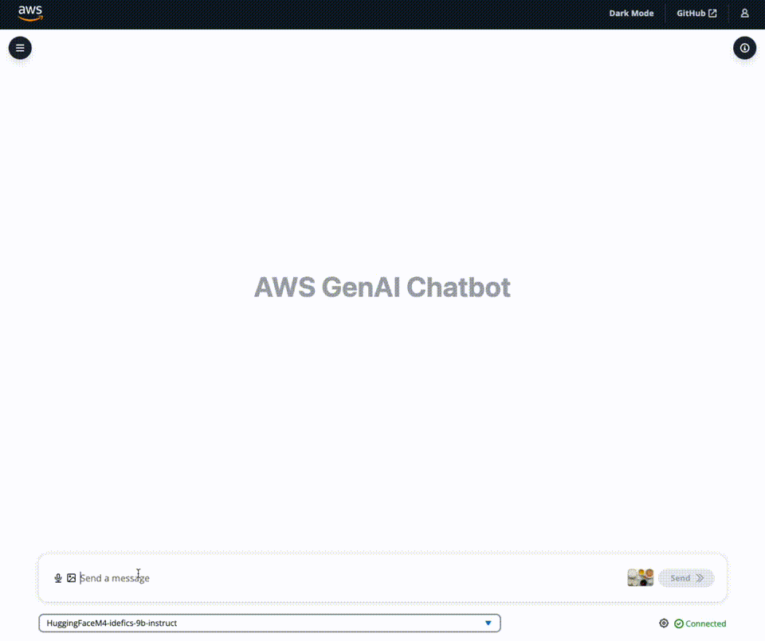
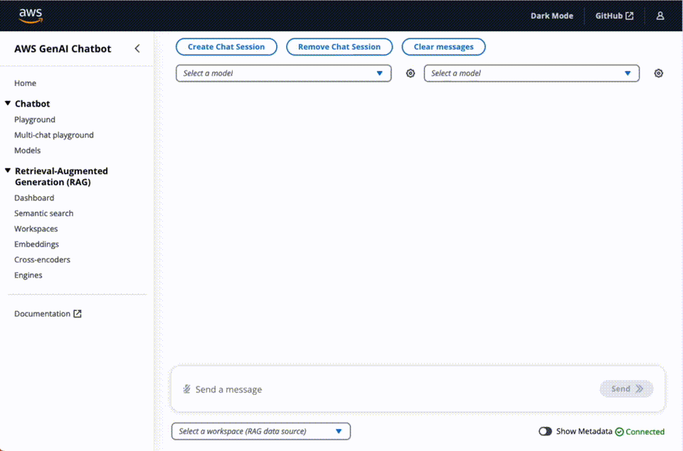
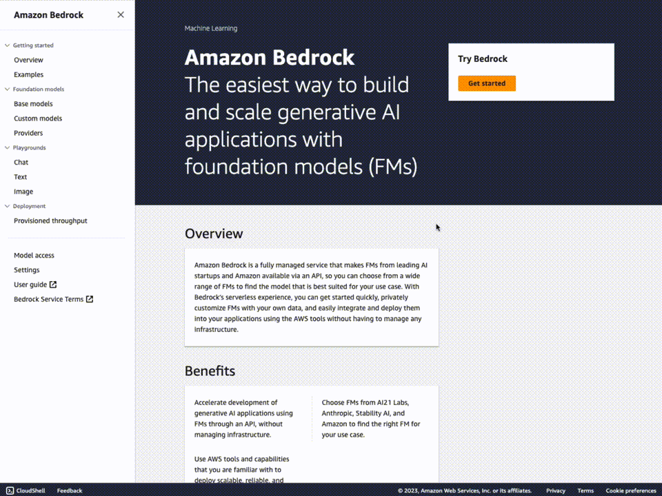

# Deploying a Multi-Model and Multi-RAG Powered Chatbot Using AWS CDK on AWS

[](https://github.com/aws-samples/aws-genai-llm-chatbot/releases)
[](https://star-history.com/#aws-samples/aws-genai-llm-chatbot)
[](https://opensource.org/licenses/MIT)

[](#deploy-with-github-codespaces)


## Table of content

- [Features](#features)
- [Precautions](#precautions)
- [Prequirements](#requirements)
  - [Self hosted models on Amazon SageMaker](#amazon-sagemaker-requirements-for-self-hosted-models-only)
  - [Amazon Bedrock](#amazon-bedrock-requirements)
  - [Third party models](#third-party-models-requirements)
- [Deploy](#deploy)
  - [With AWS Cloud9](#deploy-with-aws-cloud9)
  - [With GitHub Codespaces](#deploy-with-github-codespaces)
  - [Local deployment](#local-deployment)
- [Clean up](#clean-up)
- [Authors](#authors)
- [Credits](#credits)
- [License](#license)

# Features

## Modular, comprehensive and ready to use

This solution provides ready-to-use code so you can start **experimenting with a variety of Large Language Models and Multimodal Language Models, settings and prompts** in your own AWS account.

Supported model providers:

- [Amazon Bedrock](https://aws.amazon.com/bedrock/)
- [Amazon SageMaker](https://aws.amazon.com/sagemaker/) self-hosted models from Foundation, Jumpstart and HuggingFace.
- Third-party providers via API such as Anthropic, Cohere, AI21 Labs, OpenAI, etc. [See available langchain integrations](https://python.langchain.com/docs/integrations/llms/) for a comprehensive list.

## Experiment with multimodal models

Deploy [IDEFICS](https://huggingface.co/blog/idefics) models on [Amazon SageMaker](https://aws.amazon.com/sagemaker/) and see how the chatbot can answer questions about images, describe visual content, generate text grounded in multiple images.



Currently, the following multimodal models are supported:

- [IDEFICS 9b Instruct](https://huggingface.co/HuggingFaceM4/idefics-9b)
  - Requires `ml.g5.12xlarge` instance.
- [IDEFICS 80b Instruct](https://huggingface.co/HuggingFaceM4/idefics-80b-instruct)
  - Requires `ml.g5.48xlarge` instance.

To have the right instance types and how to request them, read [Amazon SageMaker requirements](#amazon-sagemaker-requirements-for-self-hosted-models-only)

> NOTE: Make sure to review [IDEFICS models license sections](https://huggingface.co/HuggingFaceM4/idefics-80b-instruct#license).

To deploy a multimodal model, follow the [deploy instructions](#deploy)
and select one of the supported models (press Space to select/deselect) from the magic-create CLI step and deploy as [instructed in the above section](<(#deployment-dependencies-installation)>).

> ⚠️ NOTE ⚠️ Amazon SageMaker are billed by the hour. Be aware of not letting this model run unused to avoid unnecessary costs.

## Multi-Session Chat: evaluate multiple models at once

Send the same query to 2 to 4 separate models at once and see how each one responds based on its own learned history, context and access to the same powerful document retriever, so all requests can pull from the same up-to-date knowledge.



## Experiment with multiple RAG options with Workspaces

A workspace is a logical namespace where you can upload files for indexing and storage in one of the vector databases. You can select the embeddings model and text-splitting configuration of your choice.


## Unlock RAG potentials with Workspaces Debugging Tools

The solution comes with several debugging tools to help you debug RAG scenarios:

- Run RAG queries without chatbot and analyse results, scores, etc.
- Test different embeddings models directly in the UI
- Test cross encoders and analyse distances from different functions between sentences.


## Full-fledged User Interface

The repository includes a CDK construct to deploy a **full-fledged UI** built with [React](https://react.dev/) to interact with the deployed LLMs/MLMs as chatbots. Hosted on [Amazon S3](https://aws.amazon.com/s3/) and distributed with [Amazon CloudFront](https://aws.amazon.com/cloudfront/).

Protected with [Amazon Cognito Authentication](https://aws.amazon.com/cognito/) to help you interact and experiment with multiple LLMs/MLMs, multiple RAG engines, conversational history support and document upload/progress.

The interface layer between the UI and backend is built with [AppSync](https://docs.aws.amazon.com/appsync/latest/devguide/what-is-appsync.html) for management requests and for realtime interaction with chatbot (messages and responses) using GraphQL subscriptions.

Design system provided by [AWS Cloudscape Design System](https://cloudscape.design/).

# ⚠️ Precautions ⚠️

Before you begin using the solution, there are certain precautions you must take into account:

- **Cost Management with self-hosted models on SageMaker**: Be mindful of the costs associated with AWS resources, especially with SageMaker models billed by the hour. While the sample is designed to be cost-effective, leaving serverful resources running for extended periods or deploying numerous LLMs/MLMs can quickly lead to increased costs.

- **Licensing obligations**: If you choose to use any datasets or models alongside the provided samples, ensure you check the LLM code and comply with all licensing obligations attached to them.

- **This is a sample**: the code provided in this repository shouldn't be used for production workloads without further reviews and adaptation.

# Amazon SageMaker requirements (for self-hosted models only)

**Instance type quota increase**

If you are looking to self-host models on Amazon SageMaker, you'll likely need to request an increase in service quota for specific SageMaker instance types, such as the `ml.g5` instance type. This will give access to the latest generation of GPU/Multi-GPU instance types. [You can do this from the AWS console](https://console.aws.amazon.com/servicequotas/home/services/sagemaker/quotas)

# Amazon Bedrock requirements

**Base Models Access**

If you are looking to interact with models from Amazon Bedrock, you need to [request access to the base models in one of the regions where Amazon Bedrock is available](https://console.aws.amazon.com/bedrock/home?#/modelaccess). Make sure to read and accept models' end-user license agreements or EULA.

Note:

- You can deploy the solution to a different region from where you requested Base Model access.
- **While the Base Model access approval is instant, it might take several minutes to get access and see the list of models in the UI.**



# Third-party models requirements

You can also interact with external providers via their API, such as AI21 Labs, Cohere, OpenAI, etc.

The provider must be supported in the [Model Interface](./lib/model-interfaces/langchain/functions/request-handler/index.py), [see available langchain integrations](https://python.langchain.com/docs/integrations/llms/) for a comprehensive list of providers.

Usually, an `API_KEY` is required to integrate with 3P models. To do so, the [Model Interface](./lib/model-interfaces/langchain/index.ts) deployes a Secrets in [AWS Secrets Manager](https://aws.amazon.com/secrets-manager/), intially with an empty JSON `{}`, where you can add your API KEYS for one or more providers.

These keys will be injected at runtime into the Lambda function Environment Variables; they won't be visible in the AWS Lambda Console.

For example, if you wish to be able to interact with AI21 Labs., OpenAI's and Cohere endpoints:

- Open the [Model Interface Keys Secret](./lib/model-interfaces/langchain/index.ts#L38) in Secrets Manager. You can find the secret name in the stack output, too.
- Update the Secrets by adding a key to the JSON

```json
{
  "AI21_API_KEY": "xxxxx",
  "OPENAI_API_KEY": "sk-xxxxxxxxxxxxxxx",
  "COHERE_API_KEY": "xxxxx"
}
```

N.B: In case of no keys needs, the secret value must be an empty JSON `{}`, NOT an empty string `''`.

make sure that the environment variable matches what is expected by the framework in use, like Langchain ([see available langchain integrations](https://python.langchain.com/docs/integrations/llms/).

# Deploy

### Environment setup

#### Deploy with AWS Cloud9

We recommend deploying with [AWS Cloud9](https://aws.amazon.com/cloud9/).
If you'd like to use Cloud9 to deploy the solution, you will need the following before proceeding:

- select at least `m5.large` as Instance type.
- use `Ubuntu Server 22.04 LTS` as the platform.

#### Deploy with Github Codespaces

If you'd like to use [GitHub Codespaces](https://github.com/features/codespaces) to deploy the solution, you will need the following before proceeding:

1. An [AWS account](https://aws.amazon.com/premiumsupport/knowledge-center/create-and-activate-aws-account/)
2. An [IAM User](https://console.aws.amazon.com/iamv2/home?#/users/create) with:

- `AdministratorAccess` policy granted to your user (for production, we recommend restricting access as needed)
- Take note of `Access key` and `Secret access key`.

To get started, click on the button below.

[](https://codespaces.new/aws-samples/aws-genai-llm-chatbot)

Once in the Codespaces terminal, set up the AWS Credentials by running

```shell
aws configure
```

```shell
AWS Access Key ID [None]: <the access key from the IAM user generated above>
AWS Secret Access Key [None]: <the secret access key from the IAM user generated above>
Default region name: <the region you plan to deploy the solution to>
Default output format: json
```

You are all set for deployment; you can now jump to [.3 of the deployment section below](#deployment-dependencies-installation).

#### Local deployment

If you have decided not to use AWS Cloud9 or GitHub Codespaces, verify that your environment satisfies the following prerequisites:

You have:

1. An [AWS account](https://aws.amazon.com/premiumsupport/knowledge-center/create-and-activate-aws-account/)
2. `AdministratorAccess` policy granted to your AWS account (for production, we recommend restricting access as needed)
3. Both console and programmatic access
4. [NodeJS 16 or 18](https://nodejs.org/en/download/) installed

   - If you are using [`nvm`](https://github.com/nvm-sh/nvm) you can run the following before proceeding
   - ```
     nvm install 16 && nvm use 16

     or

     nvm install 18 && nvm use 18
     ```

5. [AWS CLI](https://aws.amazon.com/cli/) installed and configured to use with your AWS account
6. [Typescript 3.8+](https://www.typescriptlang.org/download) installed
7. [AWS CDK CLI](https://docs.aws.amazon.com/cdk/latest/guide/getting_started.html) installed
8. [Docker](https://docs.docker.com/get-docker/) installed
   - N.B. [`buildx`](https://github.com/docker/buildx) is also required. For Windows and macOS `buildx` [is included](https://github.com/docker/buildx#windows-and-macos) in [Docker Desktop](https://docs.docker.com/desktop/)
9. [Python 3+](https://www.python.org/downloads/) installed

### Deployment

1. Clone the repository

```bash
git clone https://github.com/aws-samples/aws-genai-llm-chatbot
```

2. Move into the cloned repository

```bash
cd aws-genai-llm-chatbot
```

#### (Optional) Only for Cloud9

If you use Cloud9, increase the instance's EBS volume to at least 100GB.
To do this, run the following command from the Cloud9 terminal:

```
./scripts/cloud9-resize.sh
```

See the documentation for more details [on environment resize](https://docs.aws.amazon.com/cloud9/latest/user-guide/move-environment.html#move-environment-resize).

<a id="deployment-dependencies-installation"></a> 3. Install the project dependencies and build the project by running this command

```bash
npm install && npm run build
```

4. Once done, run the magic-create CLI to help you set up the solution with the features you care most:

```bash
npm run create
```

You'll be prompted to configure the different aspects of the solution, such as:

- The LLMs or MLMs to enable (we support all models provided by Bedrock along with SageMaker hosted Idefics, FalconLite, Mistral and more to come)
- Setup of the RAG system: engine selection (i.e. Aurora w/ pgvector, OpenSearch, Kendra..) embeddings selection and more to come.

When done, answer `Y` to create a new configuration.


Your configuration is now stored under `bin/config.json`. You can re-run the magic-create command as needed to update your `config.json`

5. (Optional) Bootstrap AWS CDK on the target account and region

> **Note**: This is required if you have never used AWS CDK on this account and region combination. ([More information on CDK bootstrapping](https://docs.aws.amazon.com/cdk/latest/guide/cli.html#cli-bootstrap)).

```bash
npx cdk bootstrap aws://{targetAccountId}/{targetRegion}
```

You can now deploy by running:

```bash
npx cdk deploy
```

> **Note**: This step duration can vary greatly, depending on the Constructs you are deploying.

You can view the progress of your CDK deployment in the [CloudFormation console](https://console.aws.amazon.com/cloudformation/home) in the selected region.

6. Once deployed, take note of the `User Interface`, `User Pool` and, if you want to interact with [3P models providers](#3p-models-providers), the `Secret` that will, eventually, hold the various `API_KEYS` should you want to experiment with 3P providers.

```bash
...
Outputs:
GenAIChatBotStack.UserInterfaceUserInterfaceDomanNameXXXXXXXX = dxxxxxxxxxxxxx.cloudfront.net
GenAIChatBotStack.AuthenticationUserPoolLinkXXXXX = https://xxxxx.console.aws.amazon.com/cognito/v2/idp/user-pools/xxxxx_XXXXX/users?region=xxxxx
GenAIChatBotStack.ApiKeysSecretNameXXXX = ApiKeysSecretName-xxxxxx
...
```

7. Open the generated **Cognito User Pool** Link from outputs above i.e. `https://xxxxx.console.aws.amazon.com/cognito/v2/idp/user-pools/xxxxx_XXXXX/users?region=xxxxx`

8. Add a user that will be used to log into the web interface.

9. Open the `User Interface` Url for the outputs above, i.e. `dxxxxxxxxxxxxx.cloudfront.net`

10. Login with the user created in .8; you will be asked to change the password.

# Run user interface locally

See instructions in the README file of the [`lib/user-interface/react-app`](./lib/user-interface/react-app/README.md) folder.

# Using Kendra with a non-english index

If you're using Kendra with an index in a language other than English, you will need to make some code modifications.

You'll need to modify the filters in the file `lib/shared/layers/python-sdk/python/genai_core/kendra/query.py`.

Example for french :

```python
    if kendra_index_external or kendra_use_all_data:
        result = kendra.retrieve(
            IndexId=kendra_index_id,
            QueryText=query,
            PageSize=limit,
            PageNumber=1,
            AttributeFilter={'AndAllFilters': [{"EqualsTo": {"Key": "_language_code","Value": {"StringValue": "fr"}}}]}
        )
    else:
        result = kendra.retrieve(
            IndexId=kendra_index_id,
            QueryText=query,
            PageSize=limit,
            PageNumber=1,
            AttributeFilter={'AndAllFilters':
                [
                    {"EqualsTo": {"Key": "_language_code","Value": {"StringValue": "fr"}}},
                    {"EqualsTo": {"Key": "workspace_id","Value": {"StringValue": workspace_id}}}
                ]
            }
        )
```

Please note: If these adjustments are made post-deployment, it's essential to rebuild and redeploy. If done prior to deployment, you can proceed with the walkthrough as usual.

```bash
npm install && npm run build
npx cdk deploy
```

# Clean up

You can remove the stacks and all the associated resources created in your AWS account by running the following command:

```bash
npx cdk destroy
```

> **Note**: Depending on which resources have been deployed. Destroying the stack might take a while, up to 45m. If the deletion fails multiple times, please manually delete the remaining stack's ENIs; you can filter ENIs by VPC/Subnet/etc using the search bar [here](https://console.aws.amazon.com/ec2/home#NIC) in the AWS console) and re-attempt a stack deletion.

# Architecture

This repository comes with several reusable CDK constructs. Giving you the freedom to decide what to deploy and what not.

Here's an overview:


# Authors

- [Bigad Soleiman](https://www.linkedin.com/in/bigadsoleiman/)
- [Sergey Pugachev](https://www.linkedin.com/in/spugachev/)

# Credits

This sample was made possible thanks to the following libraries:

- [langchain](https://python.langchain.com/docs/get_started/introduction.html) from [LangChain AI](https://github.com/langchain-ai)
- [unstructured](https://github.com/Unstructured-IO/unstructured) from [Unstructured-IO](https://github.com/Unstructured-IO/unstructured)
- [pgvector](https://github.com/pgvector/pgvector) from [Andrew Kane](https://github.com/ankane)

# License

This library is licensed under the MIT-0 License. See the LICENSE file.

- [Changelog](CHANGELOG.md) of the project.
- [License](LICENSE) of the project.
- [Code of Conduct](CODE_OF_CONDUCT.md) of the project.
- [CONTRIBUTING](CONTRIBUTING.md#security-issue-notifications) for more information.
