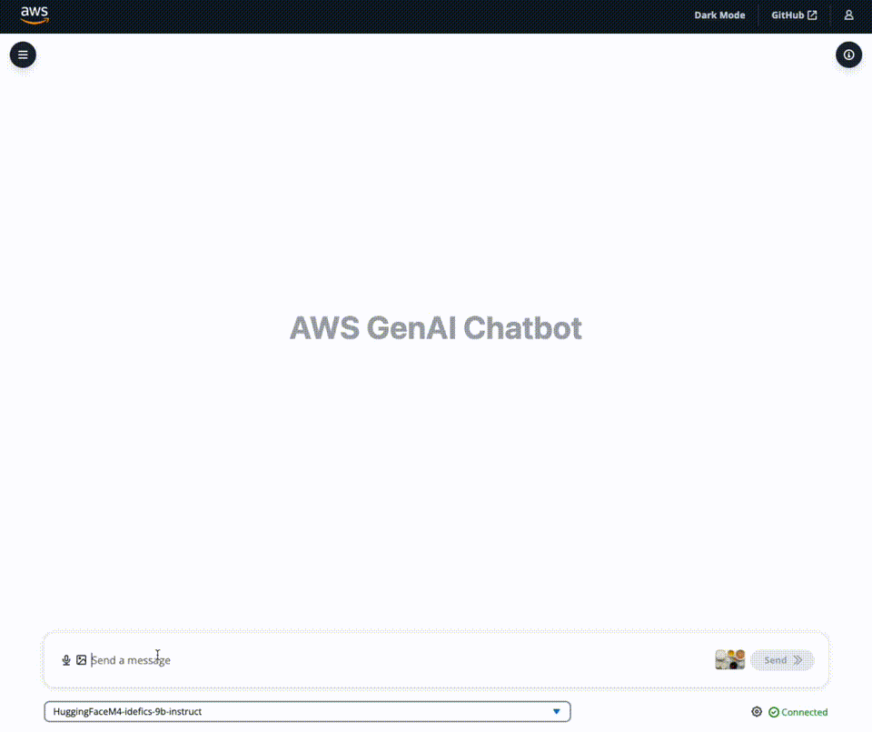
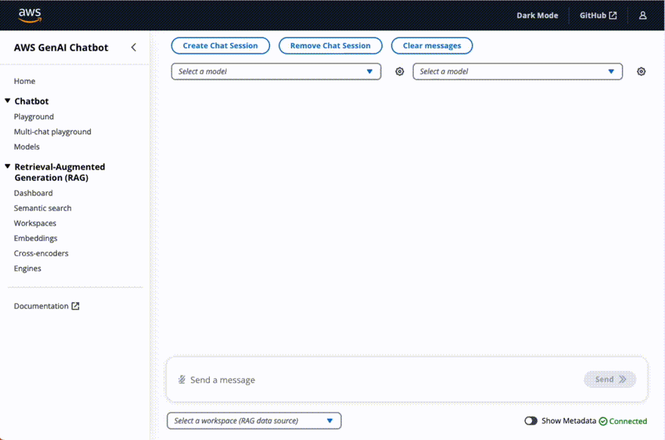
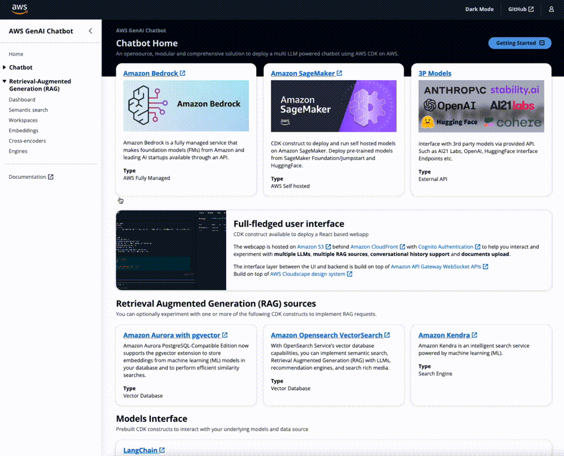

# Features

## Modular, comprehensive and ready to use

This solution provides ready-to-use code so you can start **experimenting with a variety of Large Language Models and Multimodal Language Models, settings and prompts** in your own AWS account.

Supported model providers:

- [Amazon Bedrock](https://aws.amazon.com/bedrock/)
- [Amazon SageMaker](https://aws.amazon.com/sagemaker/) self-hosted models from Foundation, Jumpstart and HuggingFace.
- Third-party providers via API such as Anthropic, Cohere, AI21 Labs, OpenAI, etc. [See available langchain integrations](https://python.langchain.com/docs/integrations/llms/) for a comprehensive list.

## Experiment with multimodal models

Deploy [IDEFICS](https://huggingface.co/blog/idefics) models on [Amazon SageMaker](https://aws.amazon.com/sagemaker/) and see how the chatbot can answer questions about images, describe visual content, generate text grounded in multiple images.

Currently, the following multimodal models are supported:

- [IDEFICS 9b Instruct](https://huggingface.co/HuggingFaceM4/idefics-9b)
  - Requires `ml.g5.12xlarge` instance.
- [IDEFICS 80b Instruct](https://huggingface.co/HuggingFaceM4/idefics-80b-instruct)
  - Requires `ml.g5.48xlarge` instance.

To have the right instance types and how to request them, read [Amazon SageMaker requirements](../documentation/model-requirements#amazon-sagemaker-requirements-for-self-hosted-models-only)

> NOTE: Make sure to review [IDEFICS models license sections](https://huggingface.co/HuggingFaceM4/idefics-80b-instruct#license).

To deploy a multimodal model, follow the [deploy instructions](../guide/deploy)
and select one of the supported models (press Space to select/deselect) from the magic-config CLI step and deploy as instructed in the above section.

> ⚠️ NOTE ⚠️ Amazon SageMaker are billed by the hour. Be aware of not letting this model run unused to avoid unnecessary costs.

## Multi-Session Chat: evaluate multiple models at once

Send the same query to 2 to 4 separate models at once and see how each one responds based on its own learned history, context and access to the same powerful document retriever, so all requests can pull from the same up-to-date knowledge.

## Experiment with multiple RAG options with Workspaces

A workspace is a logical namespace where you can upload files for indexing and storage in one of the vector databases. You can select the embeddings model and text-splitting configuration of your choice.

## Unlock RAG potentials with Workspaces Debugging Tools

The solution comes with several debugging tools to help you debug RAG scenarios:

- Run RAG queries without chatbot and analyse results, scores, etc.
- Test different embeddings models directly in the UI
- Test cross encoders and analyse distances from different functions between sentences.

## Full-fledged User Interface

The repository includes a CDK construct to deploy a **full-fledged UI** built with [React](https://react.dev/) to interact with the deployed LLMs/MLMs as chatbots. Hosted on [Amazon S3](https://aws.amazon.com/s3/) and distributed with [Amazon CloudFront](https://aws.amazon.com/cloudfront/).

Protected with [Amazon Cognito Authentication](https://aws.amazon.com/cognito/) to help you interact and experiment with multiple LLMs/MLMs, multiple RAG engines, conversational history support and document upload/progress.

The interface layer between the UI and backend is built with [AppSync](https://docs.aws.amazon.com/appsync/latest/devguide/what-is-appsync.html) for management requests and for realtime interaction with chatbot (messages and responses) using GraphQL subscriptions.

Design system provided by [AWS Cloudscape Design System](https://cloudscape.design/).
