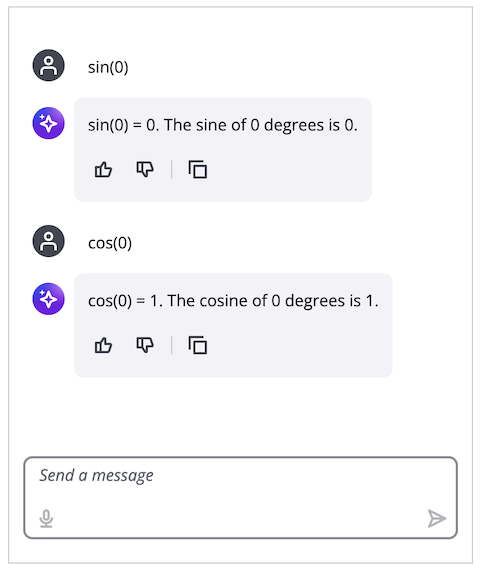

# Applications

An application is a pre-configured chatbot which could be embedded to a website. Admin users can define applications by selecting a model, model settings, workspace, and system prompts. Configured applications are then available for regular users based on their assigned role, allowing controlled access to pre-configured chat experiences. 

Roles determine which applications a user can access - for example, a "customer support" role may only be able to use applications tailored for handling support inquiries from users. Admin and workspace_manager roles are created during deployment. Additional roles can be created by creating [Cognito groups](https://docs.aws.amazon.com/cognito/latest/developerguide/cognito-user-pools-user-groups.html). Applications can then be assigned to one or more roles restricting what model and workspace an end user can use.


## Application creation and usage


## Iframe integration
1. Deploy the GenAI Chatbot on AWS.
2. Copy `GenAIChatBotStack.UserInterfaceUserInterfaceDomainName` value from the deployment output. It has `dxxxxxxxxxxxxx.cloudfront.net` format.
3. Open UI dxxxxxxxxxxxxx.cloudfront.net.
4. Create an application and open it (the URL will be used in the next step).
5. Create an Iframe with the application URL as a source.

```html
<!DOCTYPE html>
<html>
<head>
    <title>Chat Embed Test</title>
</head>
<body>
    <iframe 
        src="https://dxxxxxxxxxxxxx.cloudfront.net/application/408a4758-018b-4147-ac76-ee9c169ba775"
        width="400"
        height="480"
        allow="microphone"
        style="border: 1px solid #ccc;"
    ></iframe>
</body>
</html>
```

### Example
