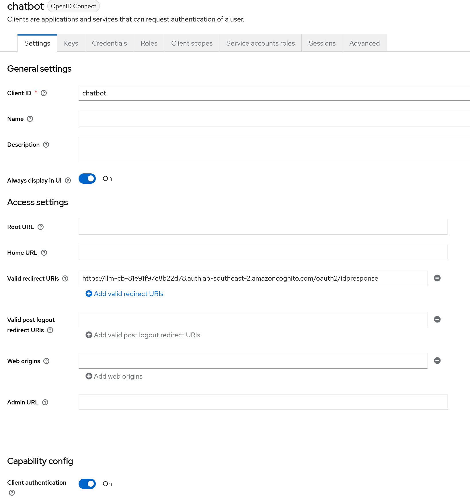

# Keycloak and Cognito OIDC integration

[Keycloak](https://github.com/keycloak/keycloak) describes itself as:

> Open Source Identity and Access Management For Modern Applications and Services 

This is a short guide on how to configure OIDC federation between cognito and keycloak. This guide is not a recommendation for keycloak and assumes a certain level of knowledge and familiarity with it.

This guide is for example purposes only and additional configuration may be required to meet your security/integration requirements.

1. Under the desired realm within keycloak navigate to clients and create a new client using the `create client` button and select `OpenID Connect`.
2. You will need to enter a `Client ID` this is something to identify the integration and then click `Next`
3. Toggle on `Client Authentication` and click `Next`
4. Finally click `Save`.
5. You will need to deploy the chatbot after finishing its confiugration before creating the OIDC client within Keycloak.
6. See details on [Cognito Overview](./overview.md) for the configuration options for federation
7. Use the `Client ID` set previously and grab the `Client Secret` from the `Credentials` tab within the previously created keycloak client.
7. You will need to supply the OIDC issuer base url for keycloak to the installer however. In Keycloak this is found under Realm Settings for the KeycLoak Realm you will create the client under. For example: `https://<keycloak-domain>/realms/NGINX/`
8. Once the chatbot has been successfully deployed we can now update the Keycloak Client with the `Valid redirect URIs`, field must be set to the Cognito Hosted UI domain name with `/oauth2/idresponse` (see below picture for example). then click `Save`.

You may also want to map metadata attributes such as email, firstname, lastname etc. however this is not covered in this guide.