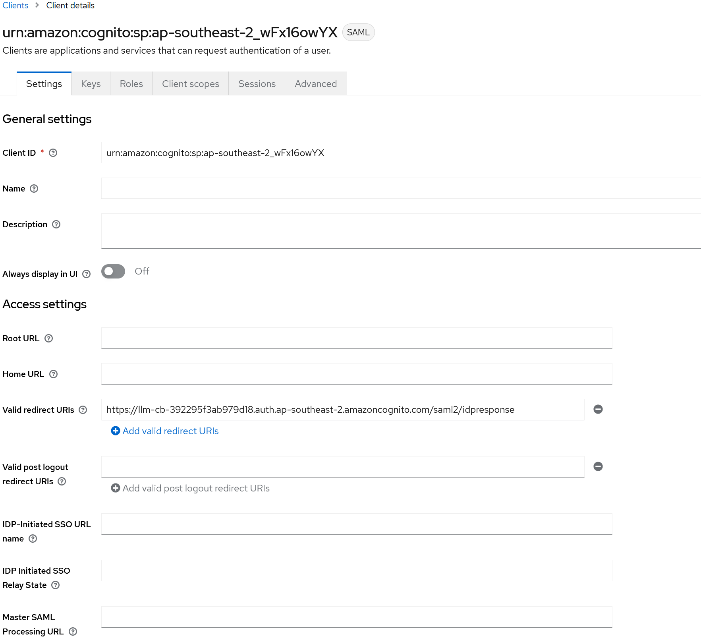

# Keycloak and Cognito SAML integration

[Keycloak](https://github.com/keycloak/keycloak) describes itself as:

> Open Source Identity and Access Management For Modern Applications and Services 

This is a short guide on how to configure OIDC federation between cognito and keycloak. This guide is not a recommendation for keycloak and assumes a certain level of knowledge and familiarity with it.

This guide is for example purposes only and additional configuration may be required to meet your security/integration requirements.

1. You will need to deploy the chatbot after finishing its confiugration before creating the SAML client within Keycloak.
2. See details on [Cognito Overview](./overview.md) for the configuration options for federation
3. You will need to supply the SAML metadata endpoint for keycloak to the installer however. In Keycloak this is found under Realm Settings for the KeycLoak Realm you will create the client under. For example: `https://<keycloak-domain>/realms/<realm-name>/protocol/saml/descriptor`
4. Once the chatbot has been successfully deployed you can now create a keycloak SAML client.
5. Under the desired realm within keycloak navigate to clients and create a new client using the `create client` button and select `SAML`.
6. There are only 2 mandatory fields to get basic functionality with Cognito and that is `Client ID` and `Valid redirect URIs`
7. The `Client ID` field must be set to the cognito user pool ID for example `ap-southeast-2_5fB2IORep` then click `next`
8. The `Valid redirect URIs` field must be set to the Cognito Hosted UI domain name with `/saml2/idresponse` (see below picture for example). then click `Save`saved
9. Keycloak and Cognito both have detailed configuration options available and consideration should be given to what would work for your environment.
10. Once completed you should be able to see a client thats been created within Keycloak that looks like the below:

You may also want to map metadata attributes such as email, firstname, lastname etc. however this is not covered in this guide.