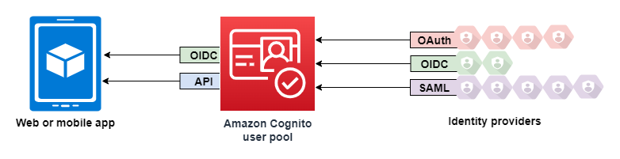
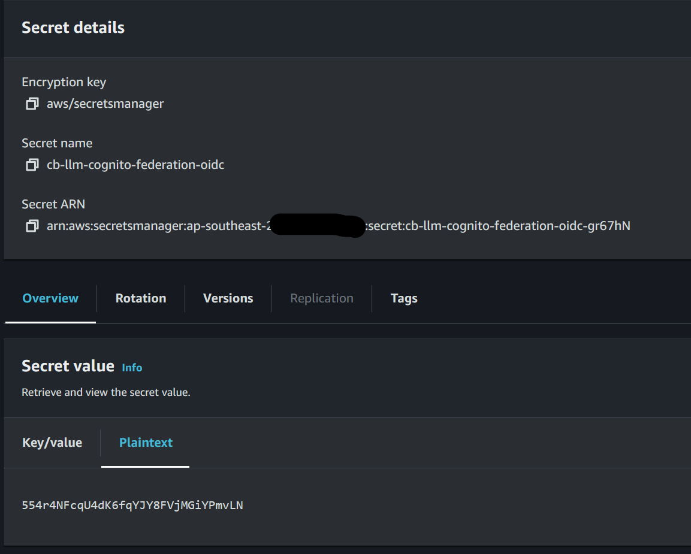

# Cognito Federation Overview

This feature when enabled allows you to enable cognito federated login via a custom OIDC or SAML provider.

Examples of this would be wanting to enable your users to login via SAML from an ADFS server, OIDC/SAML with Entra ID, Keycloak, Okta, Auth0 and more.

At a high level you can see the architecture here:

You can learn more about how federated sign-in works in Amazon Cognito user pools in the AWS docs [here](https://docs.aws.amazon.com/cognito/latest/developerguide/cognito-user-pools-identity-federation.html).

## Configuration options

Configuration options in the installer made available by this feature are as follows:

1. "Do you want to enable Federated (SSO) login with Cognito?" => `true/false`

> This turns on or off cognito federation, when false the solution falls back to local cognito user pool managed users.

2. "Please enter the name of the SAML/OIDC Federated identity provider that is or will be setup in Cognito" => `string`

> This is the name of the federation provider created and is also the name of the button users will see on the logon page.

3. "Do you want to setup a SAML or OIDC provider? or choose to do this later after install" => `[SAML, OIDC, Later]`

> Here you can choose to setup a SAML or OIDC provider, alternatively you can choose to configure the provider yourself within Cognito after deployment. This is useful when you have specific requirements that aren't supported in the installer or don't have the details yet. This will setup the chatbot with federation enabled and you will just need to ensure when you set it up in Cognito that you do so with the same name as provided above.

4. [SAML] "Provide a URL to a SAML metadata document. This document is issued by your SAML provider." => `URL`

> Here is where you provide a link to the metadata document from your SAML provider. With a Keycloak provider the url looks like this *https://\<keycloak-server\>/realms/\<realm-name\>/protocol/saml/descriptor* with Entra ID it looks like this *https://login.microsoftonline.com/<TenantDomainName\>/FederationMetadata/2007-06/FederationMetadata.xml*

5. [OIDC] "Enter the client ID provided by OpenID Connect identity provider." => `string`

> Provide the OIDC client ID that should be used

6. [OIDC] "Enter the secret manager ARN containing the OIDC client secret to use (see docs for info)" => `Secrets Manager ARN`

> Provide the ARN of the secret within secrets manager containing a plaintext only value of the OIDC Client Secret to be used. By setting it within secrets manager this ensures the secret isn't stored in plain text configuration files or within CloudFormation. Example ARN: *arn:aws:secretsmanager:ap-southeast-2:111504783555:secret:cb-llm-cognito-federation-oidc-gr67hN*

7. [OIDC] "Enter the issuer URL you received from the OIDC provider." => `string`

> Enter the issuer URL for example with keycloak this looks like https://\<keycloak-server\>/realms/\<realm-name\>/

8. "Would you like to automatically redirect users to this identity provider?" => `true/false`

> If you only expect users to login via the federated provider and don't need local cognito login as well, you can set this to true to automatically redirect users to login via the federated provider when visiting the webpage. Preventing them from needing to click login on the logon page.

9. Each user must have following user attributes: email and custom:chatbot_role with the expected role to be able to use the Chatbot. The value of the attribute should match the Cognito user group name.

## Additional configuration

At this time we havent built in specifying attribute mapping between the federated provider and cognito, you can still do this but it must be setup post deployment within the cognito console.

## Limitations

- We support only 1 federation provider plus cognito login. You cannot use multiple Federation providers at this time.
- We only support OIDC issuer URL and not supplying a discrete URL for each component of the OIDC workflow.
- We only support SAML metadata retreival via URL and not supplying SAML metadata via files.

## Provider Guides

We have some guides available that show how to setup the provider side of the federation configuration.

- [Keycloak OIDC setup](./keycloak-oidc.md)
- [Keycloak SAML setup](./keycloak-saml.md)

## OIDC Client Secret setup via Secrets Manager