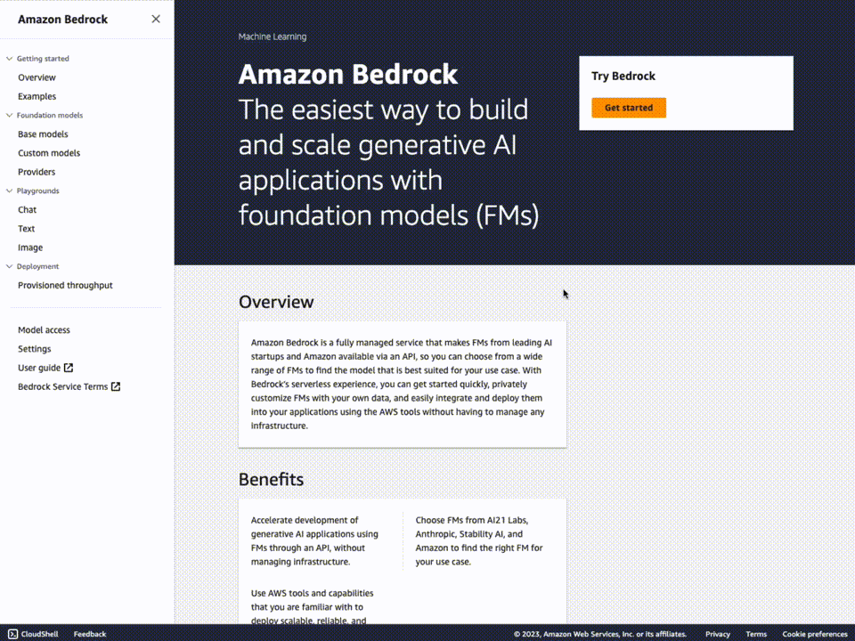

# Model Requirements

## Amazon SageMaker requirements (for self-hosted models only)

**Instance type quota increase**

If you are looking to self-host models on Amazon SageMaker, you'll likely need to request an increase in service quota for specific SageMaker instance types, such as the `ml.g5` instance type. This will give access to the latest generation of GPU/Multi-GPU instance types. [You can do this from the AWS console](https://console.aws.amazon.com/servicequotas/home/services/sagemaker/quotas)

## Amazon Bedrock requirements

**Base Models Access**

If you are looking to interact with models from Amazon Bedrock, you need to [request access to the base models in one of the regions where Amazon Bedrock is available](https://console.aws.amazon.com/bedrock/home?#/modelaccess). Make sure to read and accept models' end-user license agreements or EULA.

Note:

- You can deploy the solution to a different region from where you requested Base Model access.
- **While the Base Model access approval is instant, it might take several minutes to get access and see the list of models in the UI.**



## HuggingFace Authentication

Some models hosted on HuggingFace require an API key for access, for example MistralAI and Meta models have now changed to be gated behind accepting their EULA

If you wish to continue using these models or access other models on HuggingFace which require authentication you can now supply this HF token as part of the installer.

When enabling sagemaker models in the installer it will now ask you for a Secrets Manager Secret ARN containing the HF API token.

You can read more about setting up access tokens on the [HF website](https://huggingface.co/docs/hub/en/security-tokens) Once you've got a token you may need to also navigate to a models page such as mistral7B to accept their terms before you can then use your token to access the model.

The secret you would create in secrets manager would be a plain text secret containing just the HF token itself.

## Third-party models requirements

You can also interact with external providers via their API, such as AI21 Labs, Cohere, OpenAI, etc.

The provider must be supported in the [Model Interface](https://github.com/aws-samples/aws-genai-llm-chatbot/blob/main/lib/model-interfaces/langchain/functions/request-handler/index.py), [see available langchain integrations](https://python.langchain.com/docs/integrations/llms/) for a comprehensive list of providers.

Usually, an `API_KEY` is required to integrate with 3P models. To do so, the [Model Interface](https://github.com/aws-samples/aws-genai-llm-chatbot/blob/main/lib/model-interfaces/langchain/index.ts) deployes a Secrets in [AWS Secrets Manager](https://aws.amazon.com/secrets-manager/), intially with an empty JSON `{}`, where you can add your API KEYS for one or more providers.

These keys will be injected at runtime into the Lambda function Environment Variables; they won't be visible in the AWS Lambda Console.

For example, if you wish to be able to interact with AI21 Labs., OpenAI's and Cohere endpoints:

- Open the [Model Interface Keys Secret](https://github.com/aws-samples/aws-genai-llm-chatbot/blob/main/lib/model-interfaces/langchain/index.ts#L38) in Secrets Manager. You can find the secret name in the stack output, too.
- Update the Secrets by adding a key to the JSON

```json
{
  "AI21_API_KEY": "xxxxx",
  "OPENAI_API_KEY": "sk-xxxxxxxxxxxxxxx",
  "COHERE_API_KEY": "xxxxx"
}
```


N.B: In case of no keys needs, the secret value must be an empty JSON `{}`, NOT an empty string `''`.

make sure that the environment variable matches what is expected by the framework in use, like Langchain ([see available langchain integrations](https://python.langchain.com/docs/integrations/llms/)).

### Azure OpenAI integration as third party model

- Open the SharedApiKeysSecretxyz in SecretManager
- Update the Secrets by adding following keys to the JSON (or Key/values): 

```
{
  "AZURE_OPENAI_MODELS": "Model1,Model2",
  "AZURE_OPENAI_API_TYPE__Model1": "azure",
  "AZURE_OPENAI_API_VERSION__Model1": "2023-05-15",
  "AZURE_OPENAI_API_BASE__Model1": "https://model1.openai.azure.com/",
  "AZURE_OPENAI_API_KEY__Model1": "xxxxxxxxxxxxxxxxxxxxxxxxxxxxxxxx",
  "AZURE_OPENAI_API_DEPLOYMENT_NAME__Model1": "Model1DeploymentName",
  "AZURE_OPENAI_API_TYPE__Model2": "azure",
  "AZURE_OPENAI_API_VERSION__Model2": "2023-07-01-preview",
  "AZURE_OPENAI_API_BASE__Model2": "https://model2.openai.azure.com/",
  "AZURE_OPENAI_API_KEY__Model2": "xxxxxxxxxxxxxxxxxxxxxxxxxxxxxxxx",
  "AZURE_OPENAI_API_DEPLOYMENT_NAME__Model2": "Model2DeploymentName"
}
```
Here we are integrating 2 other models: Model1 and Model2. 
For each one, we need to define following infos you will retrieve from your Azure OpenAI tenant. ${ModelIdentifier} is either Model1 and Model2 :
 * `AZURE_OPENAI_API_TYPE__${ModelIdentifier}`
 * `AZURE_OPENAI_API_VERSION__${ModelIdentifier}`
 * `AZURE_OPENAI_API_BASE__${ModelIdentifier}`
 * `AZURE_OPENAI_API_KEY__${ModelIdentifier}`
 * `AZURE_OPENAI_API_DEPLOYMENT_NAME__${ModelIdentifier}`