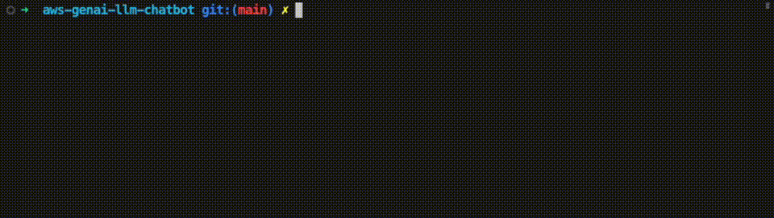

# Deploy

## Environment setup

To deploy the solution you can use 3 different methods:

1. [AWS Cloud9](#aws-cloud9) (Recommended)
2. [Github Codespaces](#github-codespaces)
3. [Local machine](#local-machine)

### AWS Cloud9

We recommend deploying with [AWS Cloud9](https://aws.amazon.com/cloud9/).

Use the [Cloud9 console](https://console.aws.amazon.com/cloud9control/home?#/create/) to create a new Cloud9 instance. Ensure you use the following values when creating the instance:

- Select `m5.large` or larger as Instance Type.
- Select `Ubuntu Server 22.04 LTS` as Platform.

The default EBS volume create with the Cloud9 instance is too small and you need to increase it to at least 100GB.
To do this, run the following command from the Cloud9 terminal:

```
./scripts/cloud9-resize.sh
```

See the documentation for more details on [environment resize](https://docs.aws.amazon.com/cloud9/latest/user-guide/move-environment.html#move-environment-resize).

You can now proceed with the [deployment](#deployment)

### Github Codespaces

To use [GitHub Codespaces](https://github.com/features/codespaces) to deploy the solution, you need the following before proceeding:

1. An [AWS account](https://aws.amazon.com/premiumsupport/knowledge-center/create-and-activate-aws-account/)
2. An [IAM User](https://console.aws.amazon.com/iamv2/home?#/users/create) with **AdministratorAccess** policy granted (for production, we recommend restricting access as needed)

After creating the user, take note of `Access Key ID` and `Secret Access Key`.

Next, click on the button below to open your Codespaces environment.

[](https://codespaces.new/aws-samples/aws-genai-llm-chatbot)

Once in the Codespaces terminal, set up the AWS Credentials by running

```shell
aws configure
```

```shell
AWS Access Key ID [None]: <the access key from the IAM user generated above>
AWS Secret Access Key [None]: <the secret access key from the IAM user generated above>
Default region name: <the region you plan to deploy the solution to>
Default output format: json
```

You are all set for deployment; you can now jump to [step 3 of the deployment section below](#deployment-dependencies-installation).

### Local machine

If are using a local machine, verify that your environment satisfies the following prerequisites:

You have:

1. An [AWS account](https://aws.amazon.com/premiumsupport/knowledge-center/create-and-activate-aws-account/)
2. An [IAM User](https://console.aws.amazon.com/iamv2/home?#/users/create) with **AdministratorAccess** policy granted (for production, we recommend restricting access as needed)
3. [NodeJS 18 or 20](https://nodejs.org/en/download/) installed

   - If you are using [`nvm`](https://github.com/nvm-sh/nvm) you can run the following before proceeding
     ```
     nvm install 18 && nvm use 18
     ```
     or
     ```
     nvm install 20 && nvm use 20
     ```

4. [AWS CLI](https://aws.amazon.com/cli/) installed and configured to use with your AWS account
5. [AWS CDK CLI](https://docs.aws.amazon.com/cdk/latest/guide/getting_started.html) installed
6. [Docker](https://docs.docker.com/get-docker/) installed
   - N.B. [`buildx`](https://github.com/docker/buildx) is also required. For Windows and macOS `buildx` [is included](https://github.com/docker/buildx#windows-and-macos) in [Docker Desktop](https://docs.docker.com/desktop/)
7. [Python 3+](https://www.python.org/downloads/) installed

## Deployment

Before you start, please read the [precautions](../documentation/precautions.md) and [security](../documentation/vulnerability-scanning.md) pages.

**Step 1.** Clone the repository.

```bash
git clone https://github.com/aws-samples/aws-genai-llm-chatbot
```

**Step 2.** Move into the cloned repository.

```bash
cd aws-genai-llm-chatbot
```

**Step 3.** <a id="deployment-dependencies-installation"></a> Install the project dependencies and build the project.

```bash
npm ci && npm run build
```

**Step 4.** (Optional) Run the unit tests

```bash
npm run test && pip install -r pytest_requirements.txt && pytest tests
```

**Step 5.** Once done, run the configuration command to help you set up the solution with the features you need:

```bash
npm run config
```

You'll be prompted to configure the different aspects of the solution, such as:

- The LLMs or MLMs to enable (we support all models provided by Bedrock that [were enabled](https://docs.aws.amazon.com/bedrock/latest/userguide/model-access.html) along with SageMaker hosted Idefics, FalconLite, Mistral and more to come).
- Setup of the RAG system: engine selection (i.e. Aurora w/ pgvector, OpenSearch, Kendra).
- Embeddings selection.
- Limit accessibility to website and backend to VPC (private chatbot).
- Add existing Amazon Kendra indices as RAG sources

When done, answer `Y` to create or update your configuration.



Your configuration is now stored under `bin/config.json`. You can re-run the `npm run config` command as needed to update your `config.json`

**Step 6.** (Optional) Bootstrap AWS CDK on the target account and region

> **Note**: This is required if you have never used AWS CDK on this account and region combination. ([More information on CDK bootstrapping](https://docs.aws.amazon.com/cdk/latest/guide/cli.html#cli-bootstrap)).

```bash
npm run cdk bootstrap aws://{targetAccountId}/{targetRegion}
```

You can now deploy by running:

```bash
npm run cdk deploy
```

> **Note**: This step duration can vary greatly, depending on the Constructs you are deploying.

You can view the progress of your CDK deployment in the [CloudFormation console](https://console.aws.amazon.com/cloudformation/home) in the selected region.

**Step 7.** Once deployed, take note of the `User Interface`, `User Pool` and, if you want to interact with [3P models providers](#3p-models-providers), the `Secret` where to store `API_KEYS` to access 3P model providers.

```bash
...
Outputs:
GenAIChatBotStack.UserInterfaceUserInterfaceDomanNameXXXXXXXX = dxxxxxxxxxxxxx.cloudfront.net
GenAIChatBotStack.AuthenticationUserPoolLinkXXXXX = https://xxxxx.console.aws.amazon.com/cognito/v2/idp/user-pools/xxxxx_XXXXX/users?region=xxxxx
GenAIChatBotStack.ApiKeysSecretNameXXXX = ApiKeysSecretName-xxxxxx
...
```

**Step 8.** Open the generated **Cognito User Pool** Link from outputs above i.e. `https://xxxxx.console.aws.amazon.com/cognito/v2/idp/user-pools/xxxxx_XXXXX/users?region=xxxxx`

**Step 9.** Add a user that will be used to log into the web interface.

**Step 10.** Open the `User Interface` Url for the outputs above, i.e. `dxxxxxxxxxxxxx.cloudfront.net`.

**Step 11.** Login with the user created in **Step 8** and follow the instructions.

**Step 12.** (Optional) Run the integration tests
The tests require to be authenticated against your AWS Account because it will create cognito users. In addition, the tests will use `anthropic.claude-instant-v1` (Claude Instant), `anthropic.claude-3-haiku-20240307-v1:0` (Claude 3 Haiku) and `amazon.titan-embed-text-v1` (Titan Embeddings G1 - Text) which need to be enabled in Bedrock.

To run the tests (Replace the url with the one you used in the steps above)
```bash
REACT_APP_URL=https://dxxxxxxxxxxxxx.cloudfront.net pytest integtests/ --ignore integtests/user_interface -n 3 --dist=loadfile 
```
To run the UI tests, you will fist need to download and run [geckodriver](https://github.com/mozilla/geckodriver)
```bash
REACT_APP_URL=https://dxxxxxxxxxxxxx.cloudfront.net pytest integtests/user_interface 
```

## Monitoring

Once the deployment is complete, a [Amazon CloudWatch Dashboard](https://console.aws.amazon.com/cloudwatch) will be available in the selected region to monitor the usage of the resources.

For more information, please refer to [the monitoring page](../documentation/monitoring.md)


## Run user interface locally

To experiment with changes to the the user interface, you can run the interface locally. See the instructions in the README file of the [`lib/user-interface/react-app`](https://github.com/aws-samples/aws-genai-llm-chatbot/blob/main/lib/user-interface/react-app/README.md) folder.

## Using Kendra with a non-english index

If you're using Kendra with an index in a language other than English, you will need to make some code modifications.

You'll need to modify the filters in the file `lib/shared/layers/python-sdk/python/genai_core/kendra/query.py`.

Example for french :

```python
    if kendra_index_external or kendra_use_all_data:
        result = kendra.retrieve(
            IndexId=kendra_index_id,
            QueryText=query,
            PageSize=limit,
            PageNumber=1,
            AttributeFilter={'AndAllFilters': [{"EqualsTo": {"Key": "_language_code","Value": {"StringValue": "fr"}}}]}
        )
    else:
        result = kendra.retrieve(
            IndexId=kendra_index_id,
            QueryText=query,
            PageSize=limit,
            PageNumber=1,
            AttributeFilter={'AndAllFilters':
                [
                    {"EqualsTo": {"Key": "_language_code","Value": {"StringValue": "fr"}}},
                    {"EqualsTo": {"Key": "workspace_id","Value": {"StringValue": workspace_id}}}
                ]
            }
        )
```

**Important:** After you have done these changes it's essential to redeploy the solution:

```bash
npx cdk deploy
```

## Clean up

You can remove the stacks and all the associated resources created in your AWS account by running the following command:

```bash
npx cdk destroy
```

> **Note**: Depending on which resources have been deployed. Destroying the stack might take a while, up to 45m. If the deletion fails multiple times, please manually delete the remaining stack's ENIs; you can filter ENIs by VPC/Subnet/etc using the search bar [here](https://console.aws.amazon.com/ec2/home#NIC) in the AWS console) and re-attempt a stack deletion.
